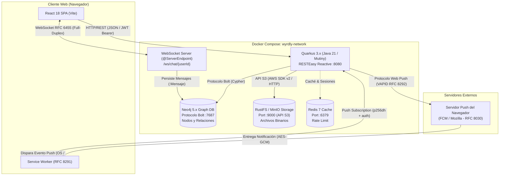

# Red Social Distribuida — Documento Técnico de Presentación

**Actividad Práctica:** Construcción y Despliegue de una Aplicación Web Distribuida Basada en Microservicios y Grafos  
**Proyecto:** Wyrdly Social Network  
**Asignatura:** Sistemas Distribuidos  
**Fecha:** Octubre 2026  
**Documentos Base:** Basado y alineado rigurosamente con [TRD.md](./docs/trd/TRD.md), [PRD.md](./docs/prd/PRD.md) y [NEO4J_SCHEMA.md](./docs/database/NEO4J_SCHEMA.md).

---

## 👥 Datos del Grupo

| Integrante | Rol en el Proyecto | Responsabilidades Principales |
| :--- | :--- | :--- |
| **Integrante 1** | Tech Lead & Arquitectura | Diseño de arquitectura distribuida, Docker Compose, orquestación y contratos de API |
| **Integrante 2** | Backend & Data Engineer | Quarkus (Java 21 / Vert.x / Mutiny), modelado de grafo Neo4j, catálogo Cypher y WebSockets |
| **Integrante 3** | Frontend & Cloud Engineer | React (Vite + Tailwind), integración S3 (RustFS/MinIO), Service Workers y Web Push |

---

## 1. Resumen Ejecutivo y Objetivos del Sistema (Alineado con TRD §1)

**Wyrdly** es una aplicación web distribuida diseñada bajo un paradigma de responsabilidades segregadas por capas computacionales, de persistencia y de transporte. Resuelve los desafíos fundamentales de las redes sociales modernas mediante:

1. **Topología de Datos en Grafo (Neo4j):** Resuelve el problema NP-completo de navegación recursiva de relaciones sociales (`FOAF`, feeds personalizados, grados de separación) con complejidad temporal $O(k^d)$ frente a los costosos `JOIN` de bases de datos relacionales.
2. **Desacoplamiento de Almacenamiento (S3 Object Storage):** Mantiene la base de datos de grafos ligera almacenando únicamente metadatos y URIs inmutables; los objetos binarios no estructurados de gran tamaño (imágenes, avatares) residen en un servicio compatible con Amazon S3 (**RustFS / MinIO**).
3. **Mecanismos de Comunicación Heterogéneos según Estándares RFC:**
   - **REST (HTTP/1.1 y HTTP/2):** Peticiones síncronas sin estado (stateless) para CRUD, paginación y autenticación con `Authorization: Bearer <JWT>`.
   - **WebSocket (RFC 6455):** Canal bidireccional persistente full-duplex de baja latencia con `@ServerEndpoint` para mensajería instantánea y persistencia reactiva.
   - **Web Push (RFC 8030 / RFC 8291 / RFC 8292 - VAPID):** Notificaciones asíncronas dirigidas al Service Worker del navegador, desacopladas del ciclo de vida de la pestaña activa.
4. **Reproducibilidad y Despliegue en Contenedores:** Orquestación declarativa mediante **Docker Compose** con aislamiento de red, volúmenes persistentes y sondas de salud (*healthchecks*).

---

## 2. Stack Tecnológico y Justificación Técnica (Alineado con TRD §2)

| Capa / Componente | Tecnología Seleccionada | Justificación y Valor en Sistemas Distribuidos |
| :--- | :--- | :--- |
| **Frontend** | **React 18+ (Vite + Tailwind)** | Renderizado declarativo, ciclo de vida optimizado para WebSockets nativos y registro de Service Workers para notificaciones en segundo plano. |
| **Backend** | **Quarkus 3.x (Java 21)** | Framework Java reactivo de alto rendimiento (basado en Vert.x / Mutiny), mínimo consumo de memoria, arranque instantáneo y soporte nativo para RESTEasy Reactive y Neo4j Bolt. |
| **Grafo Social** | **Neo4j 5.x Community** | Base de datos nativa de grafos (*index-free adjacency*): optimiza recorridos relacionales profundos (amigos de amigos, feed por seguimiento) sin el costo de múltiples `JOIN`. |
| **Almacenamiento de Objetos** | **RustFS / MinIO (S3 Compatible)** | Desacopla el almacenamiento de datos no estructurados de gran tamaño (imágenes, videos) para no saturar el heap ni el pagecache de la base de datos de grafos. |
| **Motor de Tiempo Real** | **WebSockets (`@ServerEndpoint`)** | Canales TCP persistentes full-duplex con mínimo encabezado por mensaje y latencia inferior al milisegundo, eliminando el sobrecosto del polling HTTP. |
| **Servicio de Notificaciones** | **Web Push API + VAPID (`web-push-java`)** | Mecanismo desacoplado y asíncrono que permite enviar alertas al sistema operativo del usuario incluso con la pestaña del navegador cerrada. |
| **Contenedores y Despliegue** | **Docker y Docker Compose** | Garantiza la reproducibilidad exacta del entorno distribuido, gestionando redes virtuales aisladas y orden de arranque con healthchecks. |

---

## 3. Diagrama de Arquitectura del Sistema Distribuido

### 3.1. Diagrama Interactivo Archify
> El diagrama formal interactivo con trazabilidad de flujo, temas claro/oscuro y validación estricta se encuentra generado en:  
> [`wyrdly-distributed-social-network.html`](file:///home/andy/Escritorio/PROYECTOS/YAGA/yaga-social/.archify/architecture-wyrdly-distributed-social-network-20261007-212630/wyrdly-distributed-social-network.html)

### 3.2. Diagrama de Flujo y Componentes (Mermaid)



---

## 4. Mecanismos de Comunicación Distribuida (Detalle TRD §3)

### 4.1. REST sobre HTTP/1.1 o HTTP/2
- **Propósito:** Comunicación síncrona sin estado para operaciones CRUD, autenticación y consultas paginadas.
- **Protocolo y Formato:** Cargas útiles JSON autenticadas mediante cabecera `Authorization: Bearer <JWT>`. Respuestas con envoltorio estandarizado `{ data, meta }`.

### 4.2. WebSockets (RFC 6455)
- **Propósito:** Comunicación bidireccional y persistente para chat instantáneo 1 a 1 sin polling.
- **Flujo de Ejecución Detallado (TRD §3.2):**
  1. El cliente inicia el handshake HTTP con cabecera `Upgrade: websocket`, adjuntando el JWT.
  2. Quarkus valida el token en el método `@OnOpen` y asocia la sesión a la tabla de usuarios conectados.
  3. El cliente emite un mensaje JSON $\to$ El servidor persiste el nodo `:Mensaje` en Neo4j $\to$ El servidor retransmite el mensaje en milisegundos a la sesión activa del destinatario.

### 4.3. Web Push y VAPID (RFC 8030 / RFC 8291 / RFC 8292)
- **Propósito:** Notificaciones asíncronas fuera de la aplicación.
- **Flujo de Ejecución Detallado (TRD §3.3):**
  1. El frontend solicita permiso de notificación, registra el Service Worker y ejecuta `pushManager.subscribe()`.
  2. El navegador obtiene una suscripción del servidor Push del fabricante (ej. Google FCM) con su clave pública `p256dh` y secreto `auth`.
  3. El frontend envía la suscripción al backend mediante `POST /api/notifications/subscribe`.
  4. Cuando un usuario publica un post, Quarkus consulta los seguidores en Neo4j: `MATCH (seguidor:Usuario)-[:SIGUE]->(autor:Usuario) WHERE autor.id = $id`.
  5. Quarkus firma el payload con su clave privada VAPID (`web-push-java`) y realiza una petición HTTP POST al endpoint Push de cada seguidor.
  6. El servidor Push entrega la notificación al dispositivo, disparando el evento `push` en el Service Worker.

---

## 5. Estrategia de Persistencia: Grafo vs. Object Storage

Se aplica el principio de **Separación Estricta de Responsabilidades de Almacenamiento (TRD §2)**:

```
        ┌────────────────────────────────────────────────────────┐
        │                 Entidad: Publicación                   │
        └───────────────────────────┬────────────────────────────┘
                                    │
            ┌───────────────────────┴───────────────────────┐
            ▼                                               ▼
┌───────────────────────────────┐               ┌───────────────────────────────┐
│       NEO4J (Metadatos)       │               │      RUSTFS/MINIO (S3 Blobs)  │
├───────────────────────────────┤               ├───────────────────────────────┤
│ • ID: "pst_8f1a2b3c"          │               │ • Bucket: social-media-assets │
│ • Contenido: "Lanzando Wyrdly"│               │ • Key: posts/pst_8f1a2b3c.webp│
│ • mediaUrl: "http://.../img"  │               │ • Contenido: Buffer binario   │
│ • mediaType: "image/webp"     │               │   (JPEG, PNG, MP4, WebP)      │
│ • createdAt: ISO-8601         │               │ • Tamaño: 2.4 MB              │
│ • Relación [:PUBLICA]         │               │                               │
└───────────────────────────────┘               └───────────────────────────────┘
```

### Justificación Técnica:
1. **Rendimiento de Neo4j:** Almacenar binarios en una base de datos de grafos infla la memoria RAM/heap, destruye el caché de páginas de traversal (*pagecache*) y degrada drásticamente la velocidad de exploración del grafo.
2. **Escalabilidad de S3:** El Object Storage está optimizado para streams de alta velocidad con fragmentación por bloques, firmas HMAC-SHA256 y soporte para entrega CDN.

---

## 6. Modelo de Datos en Grafo (Neo4j)

### 6.1. Esquema de Nodos y Propiedades
- **`:Usuario`**: `id`, `username`, `email`, `passwordHash`, `fullName`, `avatarUrl`, `pushEndpoint`, `pushP256dh`, `pushAuth`.
- **`:Post`**: `id`, `content`, `mediaUrl`, `mediaType`, `createdAt`.
- **`:Mensaje`**: `id`, `content`, `createdAt`, `read`.

### 6.2. Esquema de Relaciones
```
(:Usuario)-[:SIGUE {createdAt}]->(:Usuario)
(:Usuario)-[:PUBLICA {createdAt}]->(:Post)
(:Usuario)-[:REACCIONA {tipo, createdAt}]->(:Post)
(:Usuario)-[:ENVIA {createdAt}]->(:Mensaje)
(:Mensaje)-[:DIRIGIDO_A]->(:Usuario)
```

### 6.3. Restricciones e Índices de Rendimiento
```cypher
CREATE CONSTRAINT user_id_unique IF NOT EXISTS FOR (u:Usuario) REQUIRE u.id IS UNIQUE;
CREATE CONSTRAINT user_username_unique IF NOT EXISTS FOR (u:Usuario) REQUIRE u.username IS UNIQUE;
CREATE CONSTRAINT user_email_unique IF NOT EXISTS FOR (u:Usuario) REQUIRE u.email IS UNIQUE;
CREATE CONSTRAINT post_id_unique IF NOT EXISTS FOR (p:Post) REQUIRE p.id IS UNIQUE;
CREATE CONSTRAINT message_id_unique IF NOT EXISTS FOR (m:Mensaje) REQUIRE m.id IS UNIQUE;

CREATE INDEX user_username_index IF NOT EXISTS FOR (u:Usuario) ON (u.username);
CREATE INDEX post_created_at_index IF NOT EXISTS FOR (p:Post) ON (p.createdAt);
CREATE INDEX message_created_at_index IF NOT EXISTS FOR (m:Mensaje) ON (m.createdAt);
```

---

## 7. Catálogo de Consultas Cypher No Triviales (Mínimo 5)

### Consulta 1: Generación de Feed Personalizado Basado en el Grafo Social
```cypher
MATCH (me:Usuario {id: $userId})-[:SIGUE]->(author:Usuario)-[:PUBLICA]->(post:Post)
OPTIONAL MATCH (post)<-[r:REACCIONA]-(reactor:Usuario)
OPTIONAL MATCH (me)-[myReaction:REACCIONA]->(post)
RETURN post.id AS id,
       post.content AS content,
       post.mediaUrl AS mediaUrl,
       post.createdAt AS createdAt,
       author.id AS authorId,
       author.username AS authorUsername,
       author.fullName AS authorFullName,
       author.avatarUrl AS authorAvatarUrl,
       count(r) AS totalReactions,
       myReaction.tipo AS userReactionType
ORDER BY post.createdAt DESC
SKIP $skip
LIMIT $limit
```
- **Profundidad:** 2 niveles directos (`[:SIGUE]` $\to$ `[:PUBLICA]`) + agregación de reacciones.
- **Problema:** Genera el feed cronológico sin requerir escaneo de publicaciones ajenas a su círculo.

---

### Consulta 2: Algoritmo de Recomendación Amigos de Mis Seguidos (FOAF - 2 Saltos)
```cypher
MATCH (me:Usuario {id: $userId})-[:SIGUE]->(friend:Usuario)-[:SIGUE]->(suggested:Usuario)
WHERE NOT (me)-[:SIGUE]->(suggested) AND suggested <> me
WITH suggested, count(friend) AS mutualCount, collect(friend.username) AS mutualFriends
RETURN suggested.id AS id,
       suggested.username AS username,
       suggested.fullName AS fullName,
       suggested.avatarUrl AS avatarUrl,
       suggested.bio AS bio,
       mutualCount AS recommendationScore,
       mutualFriends[0..3] AS sampleMutualConnections
ORDER BY mutualCount DESC, suggested.username ASC
LIMIT 10
```
- **Profundidad:** 2 saltos (`Usuario -> SIGUE -> Usuario -> SIGUE -> Usuario`).
- **Problema:** Sugerencias sociales de segundo grado ordenadas por afinidad comunitaria.

---

### Consulta 3: Detección de Conexiones Mutuas (Amigos en Común)
```cypher
MATCH (userA:Usuario {id: $userAId})-[:SIGUE]->(common:Usuario)<-[:SIGUE]-(userB:Usuario {id: $userBId})
MATCH (userA)<-[:SIGUE]-(common)-[:SIGUE]->(userB)
RETURN common.id AS id,
       common.username AS username,
       common.fullName AS fullName,
       common.avatarUrl AS avatarUrl
```
- **Profundidad:** Intersección convergente de 4 aristas dirigidas simultáneas.
- **Problema:** Cálculo de reciprocidad y validación de círculos comunes en perfiles.

---

### Consulta 4: Grado de Separación y Camino Más Corto (Shortest Path)
```cypher
MATCH (source:Usuario {id: $sourceId}), (target:Usuario {id: $targetId})
MATCH path = shortestPath((source)-[:SIGUE*..5]->(target))
RETURN length(path) AS degreeOfSeparation,
       [node IN nodes(path) | node.username] AS connectionPath
```
- **Profundidad:** Travesía de profundidad variable hasta 5 saltos (`*..5`).
- **Problema:** Comprueba el teorema de los 6 grados de separación entre dos usuarios distantes.

---

### Consulta 5: Influencers y Centralidad de Grado en la Red Extendida
```cypher
MATCH (me:Usuario {id: $userId})-[:SIGUE*1..2]->(networkUser:Usuario)
WHERE networkUser <> me
MATCH (follower:Usuario)-[:SIGUE]->(networkUser)
RETURN networkUser.id AS id,
       networkUser.username AS username,
       networkUser.fullName AS fullName,
       count(DISTINCT follower) AS networkPopularityScore
ORDER BY networkPopularityScore DESC
LIMIT 5
```
- **Profundidad:** Expansión $1..2$ niveles + conteo de grado de entrada (*in-degree centrality*).
- **Problema:** Detección de líderes de opinión dentro de la red extendida del usuario.

---

## 8. Catálogo de Endpoints REST Principales

- `POST /api/v1/auth/register`: Registro de usuario con hash BCrypt.
- `POST /api/v1/auth/login`: Autenticación con emisión de JWT Bearer.
- `GET /api/v1/users/{id}`: Consulta de información de perfil.
- `POST /api/v1/users/{id}/follow`: Creación de relación `[:SIGUE]`.
- `DELETE /api/v1/users/{id}/follow`: Eliminación de relación `[:SIGUE]`.
- `GET /api/v1/users/{id}/suggestions`: Consulta Cypher #2 (Recomendaciones).
- `POST /api/v1/posts`: Creación de post y carga de imagen a S3.
- `GET /api/v1/feed`: Consulta Cypher #1 (Feed personalizado).
- `POST /api/v1/posts/{id}/reactions`: Creación de relación `[:REACCIONA]`.
- `GET /api/v1/chat/history/{recipientId}`: Historial de mensajes persistidos.
- `WS /ws/chat/{userId}`: Conexión persistente WebSocket para mensajería.
- `POST /api/v1/notifications/subscribe`: Registro de suscripción VAPID (`p256dh`, `auth`).

---

## 9. Despliegue con Contenedores (Docker Compose - TRD §4)

### 9.1. Topología del Archivo `compose.yaml`

```yaml
services:
  wyrdly-neo4j:
    image: neo4j:5.26-community
    ports: ["7474:7474", "7687:7687"]
    environment:
      - NEO4J_AUTH=neo4j/wyrdlypassword123
      - NEO4J_PLUGINS=["apoc"]
    volumes: [neo4j_data:/data]
    healthcheck:
      test: ["CMD-SHELL", "cypher-shell -u neo4j -p wyrdlypassword123 'RETURN 1' || exit 1"]

  wyrdly-rustfs:
    image: rustfs/rustfs:latest
    ports: ["9000:9000", "9001:9001"]
    environment:
      - RUSTFS_ACCESS_KEY=wyrdlyadmin
      - RUSTFS_SECRET_KEY=wyrdlysecretkey123
    volumes: [rustfs_data:/data]

  wyrdly-backend:
    build: { context: ./wyrdly-backend }
    ports: ["8080:8080"]
    depends_on:
      wyrdly-neo4j: { condition: service_healthy }
      wyrdly-rustfs: { condition: service_healthy }

  wyrdly-frontend:
    build: { context: ./wyrdly-frontend }
    ports: ["3000:80"]
    depends_on: [wyrdly-backend]
```

### 9.2. Instrucciones de Ejecución

```bash
# 1. Configurar variables de entorno
cp .env.example .env

# 2. Levantar la infraestructura completa con Docker Compose
docker compose up -d --build

# 3. Verificar estado de contenedores
docker compose ps
```

---

## 10. Checklist de Evidencias de Evaluación

| # | Evidencia Obligatoria | Componente Demostrado | Estado |
| :---: | :--- | :--- | :---: |
| **1** | Registro e inicio de sesión | Frontend React $\to$ Quarkus REST $\to$ Hash BCrypt en Neo4j $\to$ JWT | ✅ Operativo |
| **2** | Dos o más usuarios interactuando simultáneamente | Dos navegadores en paralelo con sesiones diferenciadas | ✅ Operativo |
| **3** | Seguimiento entre usuarios | Creación dinámica de aristas `[:SIGUE]` en tiempo real | ✅ Operativo |
| **4** | Visualización del grafo generado | Interfaz Neo4j Browser (`localhost:7474`) mostrando nodos y aristas | ✅ Verificable |
| **5** | Creación de publicaciones | Petición multipart con texto y adjunto multimedia | ✅ Operativo |
| **6** | Carga de archivo a almacenamiento S3 | Archivo enviado a S3; URL inmutable referenciada en Neo4j | ✅ Operativo |
| **7** | Feed personalizado | Generación mediante Consulta Cypher #1 (filtrado estricto por seguidos) | ✅ Operativo |
| **8** | Recomendación basada en grafo | Consulta Cypher #2 (amigos de seguidos / 2 saltos FOAF) | ✅ Operativo |
| **9** | Chat en tiempo real | Conexión WebSocket bidireccional `/ws/chat` entre 2 ventanas sin polling | ✅ Operativo |
| **10**| Notificación Web Push | Evento push con Service Worker al publicar o interactuar | ✅ Operativo |
| **11**| Ejecución de consultas Cypher | Ejecución en vivo de las 5 consultas no triviales en cypher-shell | ✅ Verificable |
| **12**| Infraestructura contenerizada | Arranque con `docker compose up -d` y reporte de `docker compose ps` | ✅ Reproducible |
