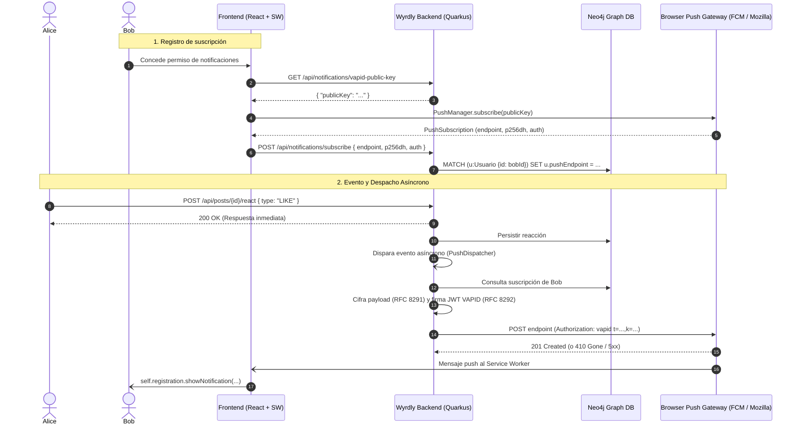

# Runbook de Operaciones: Notificaciones Web Push (VAPID)

Este documento detalla los procedimientos operativos, resolución de incidentes, rotación de claves criptográficas VAPID y estrategias de diagnóstico para el subsistema de notificaciones Web Push de Wyrdly (RFC 8030 / RFC 8291 / RFC 8292).

---

## 1. Arquitectura y Flujo de Despacho

Las notificaciones Web Push están completamente desacopladas del hilo de ejecución HTTP principal para garantizar que ninguna lentitud o caída de un push gateway externo (FCM, Mozilla Autopush, Apple WebPush) afecte la experiencia del usuario.



---

## 2. Procedimiento de Rotación de Claves VAPID

Las claves VAPID (`prime256v1` / P-256) deben rotarse periódicamente (cada 1–2 años) o inmediatamente tras un incidente de seguridad (compromiso o fuga de la clave privada).

> [!WARNING]
> Al rotar el par de claves VAPID, todas las suscripciones persistidas con la clave pública anterior serán rechazadas por los servicios de push (HTTP 400/403/410). Los clientes deberán renovar su suscripción mediante el evento `pushsubscriptionchange` del Service Worker o al iniciar sesión en el frontend.

### 2.1 Paso a Paso para la Rotación

#### Paso 1: Generar un nuevo par de claves ECDSA P-256
Ejecuta los siguientes comandos en un entorno seguro o utiliza el script de bootstrap [`wyrdly-backend/scripts/init-vapid-keys.sh`](file:///c:/Users/Gino/Proyectos/yaga-social/wyrdly-backend/scripts/init-vapid-keys.sh):

```bash
# 1. Generar nueva clave privada EC prime256v1
openssl ecparam -name prime256v1 -genkey -noout -out vapid_private_new.pem

# 2. Extraer clave pública en formato PEM
openssl ec -in vapid_private_new.pem -pubout -out vapid_public_new.pem

# 3. Convertir a formato crudo base64url sin padding para W3C / RFC 8292
# (La clave privada es el escalar d de 32 bytes en PKCS#8 o DER base64url)
```

O utilizando Node.js (`web-push` CLI):
```bash
npx web-push generate-vapid-keys --json > new_keys.json
# Genera: { "publicKey": "...", "privateKey": "..." }
```

#### Paso 2: Respaldar las claves actuales
```bash
cp /deployments/vapid/privateKey.txt /deployments/vapid/privateKey.txt.bak.$(date +%Y%m%d%H%M%S)
cp /deployments/vapid/publicKey.txt /deployments/vapid/publicKey.txt.bak.$(date +%Y%m%d%H%M%S)
```

#### Paso 3: Aplicar las nuevas claves en el volumen Docker
Reemplaza el contenido en el volumen `./vapid` montado en el contenedor:
```bash
echo -n "<NUEVA_CLAVE_PRIVADA_BASE64URL>" > ./vapid/privateKey.txt
echo -n "<NUEVA_CLAVE_PUBLICA_BASE64URL>" > ./vapid/publicKey.txt
chmod 600 ./vapid/privateKey.txt
chmod 644 ./vapid/publicKey.txt
```

#### Paso 4: Reiniciar el servicio backend
```bash
docker compose restart wyrdly-backend
```

#### Paso 5: Verificar que la nueva clave pública esté activa
```bash
# Verificar endpoint público
curl -s http://localhost:8080/api/notifications/vapid-public-key | jq .

# Verificar readiness de Quarkus
curl -s http://localhost:8080/q/health/ready | jq .
```

#### Paso 6: Limpieza opcional de suscripciones obsoletas en Neo4j
Para evitar despachos fallidos con la clave antigua, se pueden restablecer las suscripciones existentes para forzar su renovación transparente:
```cypher
MATCH (u:Usuario)
WHERE u.pushEndpoint IS NOT NULL
SET u.pushEndpoint = null, u.pushP256dh = null, u.pushAuth = null
RETURN count(u) AS suscripciones_reseteadas;
```

---

## 3. Troubleshooting de Errores 410 Gone

### 3.1 Causa Raíz
El código de estado `HTTP 410 Gone` (o `HTTP 404 Not Found`) devuelto por el gateway de push (FCM, Mozilla, etc.) indica que:
- El usuario revocó los permisos de notificaciones en la configuración del navegador o sistema operativo.
- La suscripción expiró o fue invalidada por el proveedor tras un largo período de inactividad.
- El usuario desinstaló o restableció el perfil del navegador.

### 3.2 Comportamiento del Sistema (Auto-Cleanup)
El despachador `PushDispatcherImpl` implementa **auto-cleanup automático**:
1. Incrementa el contador Micrometer: `wyrdly.push.dispatch{result="gone"}`.
2. Registra un log de nivel `INFO`:
   ```text
   subscription gone for user usr_123 (HTTP 410); cleaned up
   ```
3. Ejecuta inmediatamente `subscriptionRepository.deleteByUserId(recipientUserId)` para poner a `null` los campos `pushEndpoint`, `pushP256dh` y `pushAuth` en Neo4j.

### 3.3 Verificación y Mantenimiento Manual en Neo4j

#### Consultar cuántas suscripciones activas existen:
```cypher
MATCH (u:Usuario)
WHERE u.pushEndpoint IS NOT NULL AND u.pushEndpoint <> ''
RETURN count(u) AS total_activas;
```

#### Identificar registros que requieren saneamiento:
```cypher
MATCH (u:Usuario)
WHERE u.pushEndpoint IS NOT NULL AND (u.pushP256dh IS NULL OR u.pushAuth IS NULL)
RETURN u.id, u.username, u.pushEndpoint;
```

#### Limpiar manualmente la suscripción de un usuario específico:
```cypher
MATCH (u:Usuario {id: $userId})
SET u.pushEndpoint = null, u.pushP256dh = null, u.pushAuth = null;
```

---

## 4. Pruebas Locales sin Push Service Real

Para verificar el pipeline completo de despacho sin depender de FCM o Mozilla Autopush en entornos de desarrollo local o staging aislado:

### Opción A: Prueba de suscripción con `curl`
```bash
# 1. Obtener clave pública VAPID
curl -X GET http://localhost:8080/api/notifications/vapid-public-key

# 2. Registrar suscripción simulada
curl -X POST http://localhost:8080/api/notifications/subscribe \
  -H "Authorization: Bearer <TOKEN_JWT>" \
  -H "Content-Type: application/json" \
  -d '{
    "endpoint": "http://localhost:9999/mock-push",
    "p256dh": "BNcRdreALRFXTkOOUHK1EtK2wtaz5Ry4YwfAhCjwVqQUr4QgYqWGo6C+KAETYGo9NTelLTgkOGOHZHZFiW627C0=",
    "auth": "tBHItJI5svbpez7KI4CCXg=="
  }'
```

### Opción B: Capturar despacho con Netcat (`nc`)
En una terminal local:
```bash
# Levantar listener HTTP simulado en el puerto 9999
while true; do { echo -e 'HTTP/1.1 201 Created\r\nContent-Length: 0\r\n'; } | nc -l -p 9999; done
```
Al disparar un evento (e.g. un like o follow), el backend enviará el POST cifrado con las cabeceras `Authorization: vapid t=...`, `TTL`, `Urgency: high` y `Content-Encoding: aes128gcm`.

### Opción C: Ejecución de la suite de pruebas unitarias
```bash
mvn test -Dtest=PushDispatcherImplTest
```
Valida cifrado RFC 8291, firma RFC 8292, reintentos con backoff exponencial, auto-cleanup de 410 y rate limiting.

---

## 5. Resiliencia y Fallback ante Caídas del Gateway

Cuando el push gateway del navegador (FCM / Mozilla) experimenta interrupciones:

1. **Aislamiento de Hilos (Bulkhead)**:
   - Todo el I/O hacia los push gateways se ejecuta en un pool de hilos dedicado (`ExecutorService`), evitando que solicitudes lentas consuman los hilos HTTP del servidor REST.
2. **Reintentos y Backoff Exponencial**:
   - En respuestas `5xx`, el despachador reintenta hasta `wyrdly.push.dispatch.max-retries` veces (default: 3) con backoff exponencial inicial de `wyrdly.push.dispatch.initial-backoff-ms` (default: 200 ms).
3. **Degradación Elegante**:
   - Si el gateway continúa inaccesible, se incrementa la métrica `wyrdly.push.dispatch{result="network_error"}` o `http_5xx`.
   - La acción original del usuario (publicación de post, reacción, envío de mensaje o seguimiento) **siempre triunfa y nunca se bloquea ni revierte**.
   - La notificación in-app (feed del usuario en Neo4j) permanece intacta y disponible cuando el usuario ingrese a la aplicación.

---

## 6. Runbook de Incidentes: "Las notificaciones push no llegan"

Sigue este checklist de diagnóstico paso a paso si los usuarios reportan que no reciben notificaciones:

```
[1] ¿El endpoint VAPID responde?
    └── curl -i http://localhost:8080/api/notifications/vapid-public-key
    ├── Si falla (500/404): Revisar volumen /deployments/vapid/ y permisos de lectura.
    └── Si responde (200 OK): Continuar al paso 2.

[2] ¿El contexto es seguro (HTTPS o localhost)?
    ├── El estándar W3C Push API bloquea navigator.serviceWorker.ready y pushManager.subscribe en HTTP plano (excepto localhost).
    └── Validar que el dominio use certificado TLS válido sin errores de certificado autofirmado.

[3] ¿El usuario tiene permiso concedido en el navegador?
    ├── En DevTools (Consola): Notification.permission === 'granted'.
    └── Si es 'denied', el usuario debe habilitarlo manualmente en el candado de la barra de direcciones.

[4] ¿La suscripción existe en Neo4j?
    ├── Cypher: MATCH (u:Usuario {id: $userId}) RETURN u.pushEndpoint, u.pushP256dh;
    └── Si es null: El usuario no ha completado el flujo de suscripción en el navegador.

[5] ¿Hay despachos siendo rechazados o limitados?
    ├── Revisar Prometheus: curl -s http://localhost:8080/q/metrics | grep wyrdly_push_dispatch
    ├── Si result="rate_limited" alto: Se están disparando más de 1 push/s al mismo destinatario.
    ├── Si result="gone" alto: Suscripciones caducadas (normal si usuarios cerraron sesión).
    ├── Si result="http_4xx": Inconsistencia en la clave pública VAPID o formato de endpoint.
    └── Si result="network_error": El servidor no puede resolver DNS o conectar con fcm.googleapis.com / updates.push.services.mozilla.com (revisar egress firewall / proxy).
```
